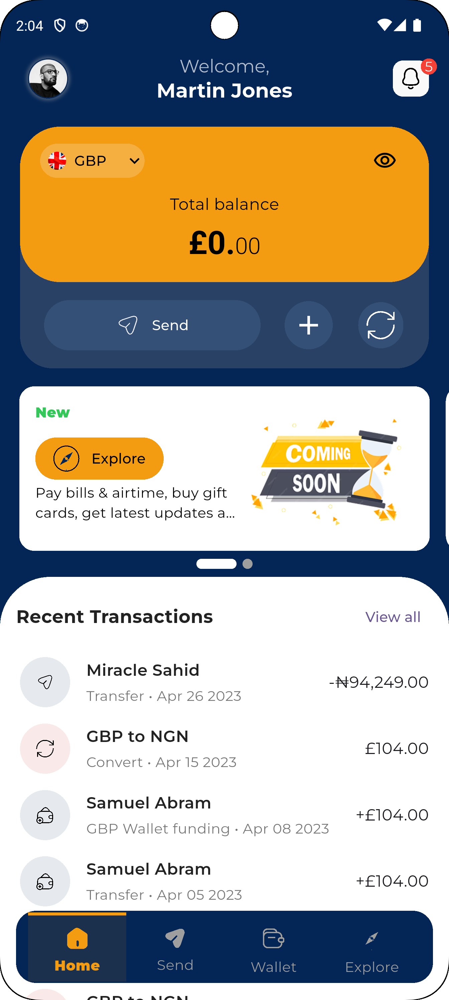
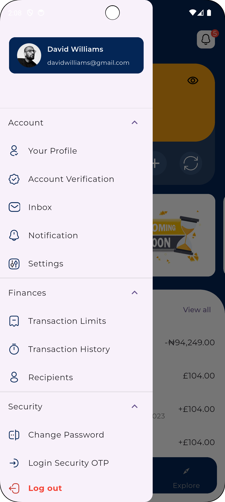

# 💳 Banking Dashboard Flutter App

A modern, animated banking dashboard mobile app built using **Flutter**, following **Clean Architecture** and **MVVM** principles. Designed to be fast, modular, and developer-friendly.

<p align="center">
   
  
</p>
---

## 🚀 Getting Started

```bash
git clone https://github.com/onwukadaniel/banking_dashboard.git
cd banking_dashboard
flutter pub get
flutter pub run build_runner build --delete-conflicting-outputs
flutter run
```

---

## 🛠️ Features

- 🧱 **Clean Architecture** for scalability and maintainability
- 🔁 **Animated Reload & Add Buttons** with smooth effects
- 💡 **Stacked ViewModels** (MVVM) for state management using `stacked` package
- 🧩 **Animated Drawer Menu** with sectioned ExpansionTiles (Account, Finances, Security, Others)
- 📦 Auto-generated assets (SVG & raster) using `build_runner`
- 🎯 Modular UI components (custom buttons, cards, indicators, tiles)
- 🌐 Localization-ready drawer with app language support

---

## 📚 Tech Stack

| Tool | Description |
|------|-------------|
| **Flutter** | Frontend SDK |
| **Stacked** | MVVM state management |
| **Build Runner** | Code generation for assets |
| **flutter_svg** | SVG rendering |
| **AnimatedList & RotationTransition** | Custom UI interactions |

---

## Folder structure

```
lib/
├── data/
│   └── models/
├── presentation/
│   └── home/
│       └── viewmodel/
│       └── views/
├── core/
│   ├── enums/
│   └── extensions/
├── assets/
│   ├── images/
│   └── svg/
├── gen/
└── main.dart
```